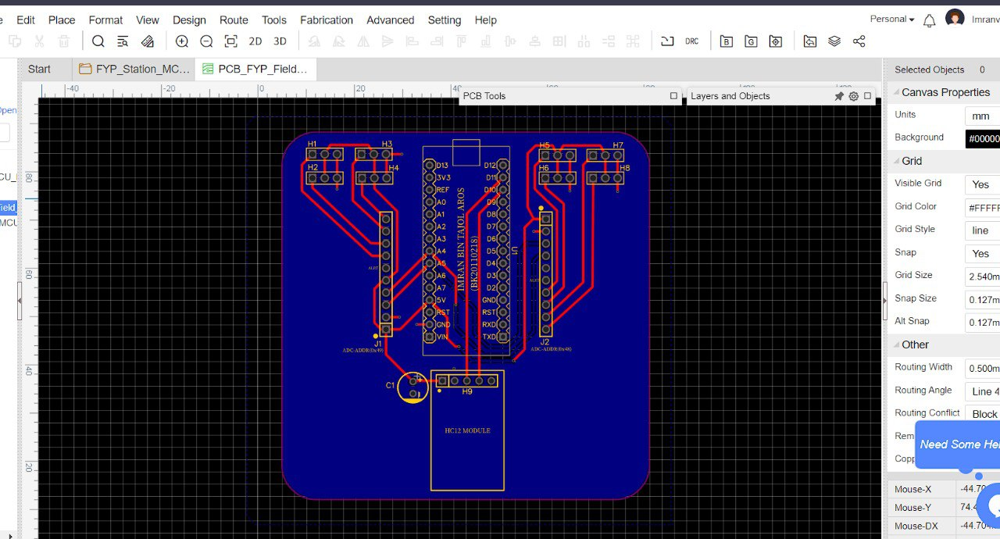

This repository stores the source code for Final Year Project 
Course: Electronic (Computer) Engineering

Project Title: Prototyping Programmable IoT Watering System for Large Vegetable Farm
Aim: To provide a programmable/customizable watering mechanism for different plots in a vegetable farm.
      Ex: 1 vege land divided into 8 plots. Each plot is planted with different type of vegetable. Amount of water supplied need to be tailored based on the type of vegetable.

Project sections
1. User Interface (Web application)
2. Station (ESP32)
3. Field (Arduino UNO / Arduino Nano)

Connectivity:
(Web UI) <------ Websocket ------> (ESP32) <------ RadioFrequency(HC12) ------> (Arduino UNO / Nano)

**User Interface:**
- Web display:
  * Vegetable type
  * Plots moisture levels
  * MCU id
  * Plant age
 
  
 **System function command:**
      * Command 1: water all plots
      * Command 2: water specific plot
      * Command 3: station request data from field
      * Command 4: sensors detect low moisture level
      * Command 5: update field microcontroller eeprom data
      

**Station Section (ESP32):**
Establish connection with WEB UI using websocket (requires Wi-Fi connection)
All Field MCU send data to ESP32
Xampp -> localhost server (Allow connection within the same network)
Broadcast data to Arduino MCU via HC12 module (433 MHz)

**Field Section (Arduino UNO/Nano):**
Parse received data.. Data format: <C,SA,DA,P> ~ <Command, Source, Destination, Payload>
MCU will check Destination Addr == Assigned address. If match, execute function based on command & payload.

